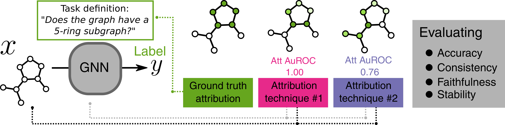

# Codebase for [_Evaluating Attribution for Graph Neural Networks_](https://papers.nips.cc/paper/2020/hash/417fbbf2e9d5a28a855a11894b2e795a-Abstract.html).




Attribution is one tool in the interpretability toolkit that provides ranked importance values on an input (x) in relation to an output (y). You might care about using attribution techniques on models if you want to build credibility, if you want to debug a model, or want to create a hypothesis for scientific discovery. Not all attribution methods are created equal and practitioners should understand the strengths and weakness of these techniques. We can evaluate these techniques because graphs are a natural testbed: we can create synthetic graph tasks where we can generate labels and ground truth attributions.

## Quickstart

A code snippet that demonstrastes how to evaluate an attribution is:
```python
import graph_attribution as gatt

task_type = 'benzene'
block_type = 'gcn'
exp, task, methods = gatt.experiments.get_experiment_setup(task_type, block_type)
hp = gatt.hparams.get_hparams({'block_type':block_type, 'task_type':task_type})
gnn = experiments.GNN.from_hparams(hp, task)
gnn(exp.x_test)
# Train model here!
pred_att = methods['CAM'].attribute(exp.x_test, gnn)
result = task.evaluate_attributions(exp.att_test, pred_att)
print(result) # A dict of attribution statistics.
```


If you want to get up and **running with building graph attributions from scratch**, we recommend you run **[notebooks/train_and_evaluate.ipynb](https://github.com/google-research/graph-attribution/blob/main/notebooks/train_attribute_and_evaluate.ipynb)** which sets up an attribution task, trains a GNN on a predictive task, and calculates attributions with several techniques, and finally evaluates the attributions. At the end of the notebook, you can visually compare graph attributions.

You can run code to **replicate all results** in the [paper][gnnatt]  using [notebooks/attribution_plot.ipynb, running live in Colab at this link](https://colab.sandbox.google.com/github/google-research/graph-attribution/blob/main/notebooks/plot_evaluation_results.ipynb).

If you'd like to run the code locally, or extend it, read on.

## What's implemented?
Attribution techniques:
* [Grad * Input][grad_times_input]
* [CAM (Class activation maps)][cam]
* [GradCAM (Gradient CAM)][gradcam]
* [SmoothGrad][smoothgrad]
* [Integrated Gradients][ig]
* [Attention weights][gat]

We test attribution quality on several GNN architectures:
* [GCN (Graph Convolution Network)][gcn], where our learnt representations depend on learnt nodes.
* [GAT (Graph Attention Network)][gat], where message passing happens via an attention mechanism.
* [MPNN (Message Passing Neural Network)][mpnn], where our learnt representations depend on learnt nodes and edges.
* [GraphNets][graphnets], learning node, edge and global embeddings and conditioning each based on these learnt attributes.

## Have an idea you want to test?

To test out new ideas check out **graph_attribution/templates.py**, which has all main abstract classes in the codebase. In particular **AttributionTask** is useful for tasks, **TransparentModel** for GNN models, **AttributionTechnique** for new attribution techniques.


## Code structure
The rest of the files are organized as:
* **data/** holds all datasets, one folder per task.
    * **data/dataset_bias** holds a folder for each spurious correlation task.
    * **data/results** holds CSV files with results from the [main publication][gnnatt].
    * **data/NOTICE** details properties of this data redistribution.
* **notebooks/** holds Jupyter notebooks.
* **scripts/** python scripts for generating datasets.
* **graph_attribution/** holds the code for creating models, generating and evaluating attributions.


## Installing
The codebase is primarily a [Tensorflow 2.0](https://www.tensorflow.org/install) based framework that uses [Sonnet](https://github.com/deepmind/sonnet) and
[Graph Nets](https://github.com/deepmind/graph_nets) for building GNN models.
If you are using pre-generated datsets, you can git clone the repo and pip install it:
```
pip install git+https://github.com/google-research/graph-attribution
```
If you plan on generating datasets, we recommend using [Anaconda](https://www.anaconda.com/) for installing all dependencies. Requirements can be installed into a fresh conda environment as follows:

```bash
$ conda env create -f environment.yml -n graph_attribution
```

Once installed you can run a notebook but running:
```bash
$ conda activate graph_attribution
$ jupyter notebook *.ipynb
```

## Giving Credit
If you use this code in your work, we ask that you cite our work. Here is an example
BibTex entry:

```
@article{NEURIPS2020_6054,
  title     = {Evaluating Attribution for Graph Neural Networks},
  author = {Benjamin Sanchez-Lengeling and Jennifer Wei and Brian Lee and Emily Reif and Wesley Qian and Yiliu Wang and Kevin James McCloskey and Lucy Colwell and Alexander B Wiltschko},
  booktitle = {Advances in Neural Information Processing Systems 33},
  year      = {2020},
  url       = {https://papers.nips.cc/paper/2020/hash/417fbbf2e9d5a28a855a11894b2e795a-Abstract.html},
}
```

## Related work
If you cite this work, you may also want to cite:

* [McCloskey, K., Taly, A., Monti, F., Brenner, M. P. & Colwell, L. J. Using attribution to decode binding mechanism in neural network models for chemistry. Proc. Natl. Acad. Sci. U. S. A. 116, 11624–11629 (2019)][bias]
* [Ying, Z., Bourgeois, D., You, J., Zitnik, M. & Leskovec, J. GNNExplainer: Generating Explanations for Graph Neural Networks. in Advances in Neural Information Processing Systems (eds. Wallach, H. et al.) vol. 32 9244–9255 (Curran Associates, Inc., 2019).][explainer]

[bias]: https://www.pnas.org/content/116/24/11624
[explainer]: https://arxiv.org/abs/1903.03894
[gnnatt]: https://papers.nips.cc/paper/2020/file/417fbbf2e9d5a28a855a11894b2e795a-Paper.pdf
[mpnn]: https://arxiv.org/abs/1704.01212
[gcn]: https://arxiv.org/abs/1509.09292
[graphnets]:arxiv.org/abs/1806.01261
[gat]: https://arxiv.org/abs/1710.10903
[grad_times_input]:https://arxiv.org/abs/1605.01713
[cam]: https://arxiv.org/abs/1512.04150
[gradcam]: https://arxiv.org/abs/1610.02391
[smoothgrad]: https://arxiv.org/abs/1706.03825
[ig]: https://arxiv.org/abs/1703.01365

This is not an official Google product.
